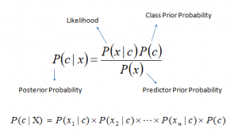

# Naive Bayes

## Summary

1. [Definition](#definition)
2. [Explanation](#explanation)
3. [Pros](#pros)
4. [Cons](#cons)
5. [Implementation](#implementation)

## 1. Definition

It is a classification technique based on Bayes’ Theorem with an assumption of independence among predictors. In simple terms, a Naive Bayes classifier assumes that the presence of a particular feature in a class is unrelated to the presence of any other feature. For example, a fruit may be considered to be an apple if it is red, round, and about 3 inches in diameter. Even if these features depend on each other or upon the existence of the other features, all of these properties independently contribute to the probability that this fruit is an apple and that is why it is known as ‘Naive’.

Above:

* P(c|x) is the posterior probability of class (c, target) given predictor (x, attributes).
* P(c) is the prior probability of class.
* P(x|c) is the likelihood which is the probability of predictor given class.
* P(x) is the prior probability of predictor.

## 2. Explanation

## 3. Pros

* It is easy and fast to predict class of test data set. It also perform well in multi class prediction
* When assumption of independence holds, a Naive Bayes classifier performs better compare to other models like logistic regression and you need less training data.
* It perform well in case of categorical input variables compared to numerical variable(s). For numerical variable, normal distribution is assumed (bell curve, which is a strong assumption).

## 4. Cons

* If categorical variable has a category (in test data set), which was not observed in training data set, then model will assign a 0 (zero) probability and will be unable to make a prediction. This is often known as “Zero Frequency”. To solve this, we can use the smoothing technique. One of the simplest smoothing techniques is called Laplace estimation.
* On the other side naive Bayes is also known as a bad estimator, so the probability outputs from predict_proba are not to be taken too seriously.
* Another limitation of Naive Bayes is the assumption of independent predictors. In real life, it is almost impossible that we get a set of predictors which are completely independent.

## 5. Implementation

[BACK to ..]() 

[BACK to Bayesian Menu](README.md)

[NEXT ..]()