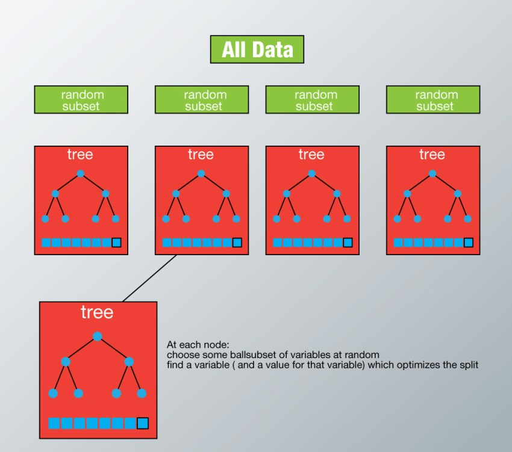

# Random Forest

## Summary

1. [Definition](#definition)
2. [Explanation](#explanation)
3. [Pros](#pros)
4. [Cons](#cons)
5. [Tuning the hyperparameters](#tuning)
	1. [Features which make better predictions](#features_A)
		1. [max_features](#max_features)
		2. [n_estimators](#n_estimators)
		3. [min_sample_leaf](#min_sample_leaf)
	2. [Features which make training easier](#features_B)
		1. [n_jobs](#n_jobs)
		2. [random_state](#random_state)
		3. [oob_score](#oob_score)
5. [Implementation](#implementation)

## 1. Definition

Random Forest is a versatile machine learning method capable of performing both regression and classification tasks. It also undertakes dimensional reduction methods, treats missing values, outlier values and other essential steps of data exploration, and does a fairly good job. It is a type of ensemble learning method, where a group of weak models combine to form a powerful model. In Random Forest, we grow multiple trees as opposed to a single tree in CART model. The forest chooses the classification having the most votes (over all the trees in the forest) and in case of regression, it takes the average of outputs by different trees.

## 2. Explanation

In Random Forest, each tree is planted & grown as follows:

1. Assume number of cases in the training set is N. Then, sample of these N cases is taken at random but with replacement. This sample will be the training set for growing the tree.

2. If there are M input variables, a number m<M is specified such that at each node, m variables are selected at random out of the M. The best split on these m is used to split the node. The value of m is held constant while we grow the forest.
Each tree is grown to the largest extent possible and  there is no pruning.

3. Predict new data by aggregating the predictions of the ntree trees (i.e., majority votes for classification, average for regression).

## 3. Pros

* As I mentioned earlier, this algorithm can solve both type of problems i.e. classification and regression and does a decent estimation at both fronts.

* One of benefits of Random forest which excites me most is, the power of handle large data set with higher dimensionality. It can handle thousands of input variables and identify most significant variables so it is considered as one of the dimensionality reduction methods. Further, the model outputs Importance of variable, which can be a very handy feature.

* It has an effective method for estimating missing data and maintains accuracy when a large proportion of the data are missing.

* It has methods for balancing errors in datasets where classes are imbalanced.

* The capabilities of the above can be extended to unlabeled data, leading to unsupervised clustering, data views and outlier detection.

* Random Forest involves sampling of the input data with replacement called as bootstrap sampling. Here one third of the data is not used for training and can be used to testing. These are called the out of bag samples. Error estimated on these out of bag samples is known as out of bag error. Study of error estimates by Out of bag, gives evidence to show that the out-of-bag estimate is as accurate as using a test set of the same size as the training set. Therefore, using the out-of-bag error estimate removes the need for a set aside test set.

## 4. Cons

* It surely does a good job at classification but not as good as for regression problem as it does not give continuous output. In case of regression, it doesn’t predict beyond the range in the training data, and that they may over-fit data sets that are particularly noisy.

* Random Forest can feel like a black box approach for statistical modelers – you have very little control on what the model does. You can at best – try different parameters and random seeds!

## 5. Tuning the hyperparameters

### 5.1. Features which make better predictions

#### 5.1.1. max\_features

These are the maximum number of features Random Forest is allowed to try in individual tree. There are multiple options available in Python to assign maximum features. Here are a few of them :

1. Auto/None : This will simply take all the features which make sense in every tree.Here we simply do not put any restrictions on the individual tree.
2. sqrt : This option will take square root of the total number of features in individual run. For instance, if the total number of variables are 100, we can only take 10 of them in individual tree.”log2″ is another similar type of option for max_features.
3. 0.2 : This option allows the random forest to take 20% of variables in individual run. We can assign and value in a format “0.x” where we want x% of features to be considered.

Increasing max_features generally improves the performance of the model as at each node now we have a higher number of options to be considered. However, this is not necessarily true as this decreases the diversity of individual tree which is the USP of random forest. But, for sure, you decrease the speed of algorithm by increasing the max_features. Hence, you need to strike the right balance and choose the optimal max_features.

#### 5.1.2. n\_estimators

This is the number of trees you want to build before taking the maximum voting or averages of predictions. Higher number of trees give you better performance but makes your code slower. You should choose as high value as your processor can handle because this makes your predictions stronger and more stable.

#### 5.1.3. min\_sample\_leaf

If you have built a decision tree before, you can appreciate the importance of minimum sample leaf size. Leaf is the end node of a decision tree. A smaller leaf makes the model more prone to capturing noise in train data. Generally I prefer a minimum leaf size of more than 50. However, you should try multiple leaf sizes to find the most optimum for your use case.

### 5.2. Features which make training easier

#### 5.2.1. n\_jobs

This parameter tells the engine how many processors is it allowed to use. A value of “-1” means there is no restriction whereas a value of “1” means it can only use one processor.

#### 5.2.2. random\_state

This parameter makes a solution easy to replicate. A definite value of random_state will always produce same results if given with same parameters and training data. I have personally found an ensemble with multiple models of different random states and all optimum parameters sometime performs better than individual random state.

#### 5.2.3. oob\_score

This is a random forest cross validation method. It is very similar to leave one out validation technique, however, this is so much faster. This method simply tags every observation used in different tress. And then it finds out a maximum vote score for every observation based on only trees which did not use this particular observation to train itself.

## 6. Implementation