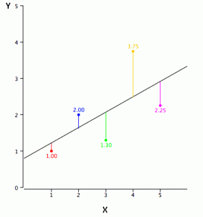

# Linear Regression

## Summary

 1. [Definition](#definition)
 2. [Explanation](#explanation)
 3. [Pros](#pros)
 4. [Cons](#cons)
 5. [Implementation](#implementation)

 [View the IPython Notebook here](linear_regression.ipynb)

## Definition

Linear Regression establishes a relationship between dependent variable (Y) and one or more independent variables (X) using a best fit straight line (also known as regression line).

For simplicity, in our case there will be no distinction between linear regression and multiple linear regression (the only natural difference being that multiple linear regression has more than one independent variable).

## Explanation

It is represented by an equation Y=a+b*X + e, where a is intercept, b is slope of the line and e is error term. This equation can be used to predict the value of target variable based on given predictor variable(s).

To obtain the best fist line is accomplished using the Least Square Method. It calculates the best-fit line for the observed data by minimizing the sum of the squares of the vertical deviations from each data point to the line. Because the deviations are first squared, when added, there is no cancelling out between positive and negative values.

## Pros

* It is an extremely simple model
* It's fast to implement and use
* IT's highly interpretable

## Cons

* There must be linear relationship between independent and dependent variables
* Multiple regression suffers from multicollinearity, autocorrelation, heteroskedasticity.
* Linear Regression is very sensitive to Outliers. It can terribly affect the regression line and eventually the forecasted values.
* Multicollinearity can increase the variance of the coefficient estimates and make the estimates very sensitive to minor changes in the model. The result is that the coefficient estimates are unstable

## Implementation
<https://github.com/justmarkham/DAT4/blob/master/notebooks/08_linear_regression.ipynb> 

[BACK to OLS](../ols/README.md) 

[BACK to Regression Menu](README.md)

[NEXT Logistic Regression]( ../instance-base-algorithms/README.md)